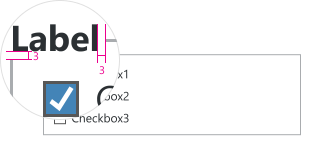

While group boxes can be a way to visually create relationships between controls, they can cause a simple interface to look overly complex.

**Pro:** Strong way to indicate relationships.  
**Con:** Overusing them adds visual clutter.

### Alternatives

Instead of group boxes, try using layout to communicate relationships. Use headings and indenting to show hierarchical relationships.  Using a separator is lighter weight and provides a cleaner look.

If you find you must use a group box:

- Don’t nest group boxes.
- Don’t put controls in group box labels 
- Don’t disable group boxes. Instead, disable all the controls inside the group box, but not the group box itself.
- Label all group boxes.
- Watch for redundancy with the group box label and the control labels.

## Layout




## XAML code snippet
This style of group box is not yet available as a control. However, you can use a `ControlTemplate` in XAML to get this style.

```xml
<!--Place the style in the resources area of your XAML file-->
<Style x:Key="GroupBoxStyle" TargetType="{x:Type GroupBox}">
    <Setter Property="Template">
        <Setter.Value>
            <ControlTemplate TargetType="{x:Type GroupBox}">
                <Grid SnapsToDevicePixels="true" Margin="0,-4,0,0">
                    <Grid.ColumnDefinitions>
                        <ColumnDefinition Width="11" MaxWidth="11"/>
                        <ColumnDefinition Width="Auto"/>
                        <ColumnDefinition Width="*"/>
                        <ColumnDefinition Width="11"/>
                    </Grid.ColumnDefinitions>
                    <Grid.RowDefinitions>
                        <RowDefinition Height="Auto"/>
                        <RowDefinition Height="Auto"/>
                        <RowDefinition Height="*"/>
                        <RowDefinition Height="9"/>
                    </Grid.RowDefinitions>
                    <Border x:Name="topRightBorder" BorderBrush="{StaticResource NIGrayNeutral68Brush}" Grid.ColumnSpan="2" Margin="0,9,0,0" Grid.RowSpan="4" Padding="0,13,0,0" Grid.Row="0" BorderThickness="0,1,1,0" Grid.Column="2"/>
                    <Border x:Name="bottomLeftBorder" BorderBrush="{StaticResource NIGrayNeutral68Brush}" BorderThickness="1,0,0,1" Grid.ColumnSpan="4" Margin="0,0,0,0" Grid.RowSpan="3" Width="Auto" Grid.Row="2" HorizontalAlignment="Stretch"/>
                    <Border x:Name="Header" Grid.Row="0" Grid.RowSpan="2" Grid.ColumnSpan="2">
                        <shell:ShellTextBlock x:Name="shellTextBlock" HorizontalAlignment="Left" Margin="0,0,3,0" UseLayoutRounding="True" Text="{TemplateBinding Header}" FontWeight="Bold"/>
                    </Border>
                    <ContentPresenter Grid.ColumnSpan="2" Grid.Column="1" Grid.Row="2" Margin="0,3,0,0" UseLayoutRounding="True"/>
                </Grid>
            </ControlTemplate>
        </Setter.Value>
    </Setter>
</Style>

<!--Place this in the layout (canvas, grid, etc.) section of your XAML file-->
<GroupBox x:Name="groupBox" Header="Group box label" VerticalAlignment="Top" Style="{DynamicResource GroupBoxStyle}" >
    <StackPanel>
        <TextBlock x:Name="textBlock" HorizontalAlignment="Left" TextWrapping="Wrap" Text="These checkboxes are examples of layout in a group box. It uses a stack panel for layout. You may need to tweak the margins depending on the controls you use. The content of this group box should have 10px of space on the left, right and bottom sides."/>
        <shell:ShellCheckBox x:Name="shellCheckBox1" Content="Checkbox1" HorizontalAlignment="Stretch" VerticalAlignment="Stretch" IsChecked="True"/>
        <shell:ShellCheckBox x:Name="shellCheckBox2" Content="Checkbox2" HorizontalAlignment="Stretch" VerticalAlignment="Stretch" Margin="0,6,0,0" IsChecked="True"/>
    </StackPanel>
</GroupBox>
```
