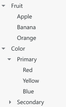

## General usage
Trees are used to display a hierarchical set of information to the user. A tree allows the user to expand and collapse sections to see their contents. It can contain multiple levels of hierarchy.

**Codename:** `ShellTreeView` - NationalInstruments.Controls.Shell  
**Codename:** `ShellTreeViewItem` - NationalInstruments.Controls.Shell

## Examples

| State         | Image         |
| ------------- |:-------------:|
| Normal        |         |
| Hover         |          |
| Selected      |     |

## Code sample
This example is created with the XAML and C# snippets below. It shows a hierarchical set of information with multiple levels of hierarchy. The items (`TreeItems`) are defined in the C# and bound to the tree in the XAML.

 

**XAML snippet**


<shellControls:ShellTreeView x:Name="shellTreeView" ItemsSource="{Binding TreeItems}">
    <shellControls:ShellTreeView.ItemTemplate>
        <HierarchicalDataTemplate ItemsSource="{Binding Children}">
            <StackPanel Orientation="Horizontal" Height="22">
                <shellControls:ShellTextBlock Text="{Binding Name}" VerticalAlignment="Center" Foreground="{StaticResource NIBlackBrush}"/>
            </StackPanel>
        </HierarchicalDataTemplate>
    </shellControls:ShellTreeView.ItemTemplate>
</shellControls:ShellTreeView>


**C# snippet**


public class Node
{
    public IEnumerable<Node> Children { get; set; }
    public string Name { get; set; }
    public Node(IEnumerable<Node> children, string name)
    {
        Children = children;
        Name = name;
    }
}

private IEnumerable<Node> _fruits = new List<Node>
{
    new Node(null, "Apple"),
    new Node(null, "Banana"),
    new Node(null, "Orange"),
};

private static IEnumerable<Node> _primaryColors = new List<Node>
{
    new Node(null, "Red"),
    new Node(null, "Yellow"),
    new Node(null, "Blue"),
};

private static IEnumerable<Node> _secondaryColors = new List<Node>
{
    new Node(null, "Green"),
    new Node(null, "Purple"),
    new Node(null, "Orange"),
};

private IEnumerable<Node> _colors = new List<Node>
{
    new Node(_primaryColors, "Primary"),
    new Node(_secondaryColors, "Secondary"),
};

public IEnumerable<Node> TreeItems
{
    get
    {
        return new List<Node>()
        {
            new Node(_fruits, "Fruit"),
            new Node(_colors, "Color"),
        };
    }
}



<!-- **Codename:** `FilteredTreeView` - NationalInstruments.Controls.Shell -->

